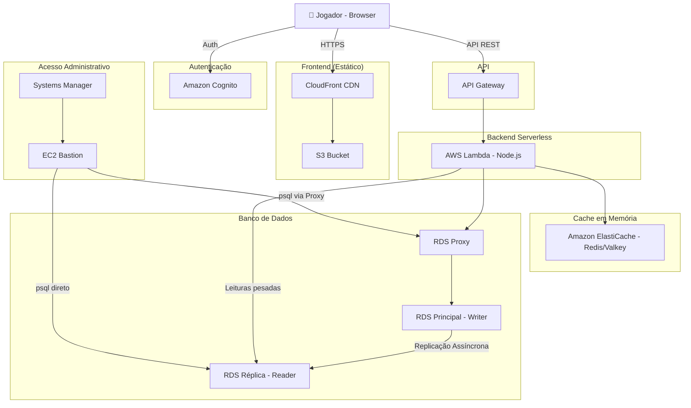

# Documento de Design — Projeto 03: Correções de Documentação RDS/Backup

## Overview

Este projeto consiste em **correções de documentação** nos arquivos do Projeto 3 (Amazon RDS, RDS Proxy, Réplica e AWS Backup). As alterações são exclusivamente em arquivos Markdown (`IMPLANTACAO.md`, `ARQUITETURA.md`, `README.md`), um script SQL (`sql/01-create-database.sql`) e verificação do `.gitignore`.

**Não há alterações de código de aplicação.** O objetivo é alinhar a documentação com a arquitetura real implantada em laboratório, onde:
- O backend roda na **AWS Lambda** (não em EC2/ECS)
- A API é exposta pelo **API Gateway** (não por ALB)
- A EC2 serve **exclusivamente como bastion** administrativo via SSM
- O acesso ao RDS passa pelo **RDS Proxy**

## Architecture

### Arquitetura Real (Corrigida)



### Diferenças entre Documentação Atual e Arquitetura Real

| Aspecto | Documentação Atual (Errado) | Realidade (Correto) |
|---------|----------------------------|---------------------|
| Backend | EC2/ECS com PM2 | AWS Lambda |
| API Entry Point | ALB (Application Load Balancer) | API Gateway |
| EC2 | Servidor de backend | Bastion administrativo via SSM |
| VITE_API_URL | `https://<ALB_DNS>` | `https://<URL_DA_API_GATEWAY>` |
| Deploy backend EC2 | `npm install`, `pm2 restart` | Não aplicável |
| Acesso ao banco | Direto do "backend na EC2" | Lambda via RDS Proxy |

## Components and Interfaces

### Arquivos a Modificar

| Arquivo | Tipo de Alteração |
|---------|-------------------|
| `sql/01-create-database.sql` | Tornar idempotente, adicionar permissões granulares |
| `IMPLANTACAO.md` | Correções extensas em múltiplas seções |
| `ARQUITETURA.md` | Atualizar diagrama e tabela de serviços |
| `README.md` | Atualizar diagrama texto e tabela de serviços |
| `.gitignore` | Verificar presença de `.env` (já está OK) |

### Detalhamento das Correções por Arquivo

#### 1. `sql/01-create-database.sql`

**Estado atual:**
```sql
CREATE USER dinogame_app WITH PASSWORD '<SENHA_SEGURA>';
GRANT CONNECT ON DATABASE dinogame TO dinogame_app;
```

**Estado corrigido:**
```sql
-- Criação idempotente do usuário
DO $$
BEGIN
  IF NOT EXISTS (SELECT FROM pg_catalog.pg_roles WHERE rolname = 'dinogame_app') THEN
    CREATE ROLE dinogame_app WITH LOGIN PASSWORD 'PLACEHOLDER_TROCAR';
  END IF;
END
$$;

-- Permissões granulares
GRANT CONNECT ON DATABASE dinogame TO dinogame_app;
GRANT USAGE ON SCHEMA public TO dinogame_app;
GRANT SELECT, INSERT, UPDATE, DELETE ON ALL TABLES IN SCHEMA public TO dinogame_app;
GRANT USAGE, SELECT ON ALL SEQUENCES IN SCHEMA public TO dinogame_app;
ALTER DEFAULT PRIVILEGES IN SCHEMA public GRANT SELECT, INSERT, UPDATE, DELETE ON TABLES TO dinogame_app;
ALTER DEFAULT PRIVILEGES IN SCHEMA public GRANT USAGE, SELECT ON SEQUENCES TO dinogame_app;
```

**Razão:** O `CREATE USER` falha se executado duas vezes. O padrão `DO $$ ... IF NOT EXISTS ...` permite re-execução sem erros. As permissões granulares seguem o princípio de menor privilégio.

---

#### 2. `IMPLANTACAO.md` — Seções a Corrigir

##### 2.1 Seção "Campos Reservados"
- Remover `<SECURITY_GROUP_BACKEND>`, `<ALB_DNS>`
- Adicionar: `<SECURITY_GROUP_BASTION>`, `<SECURITY_GROUP_LAMBDA>`, `<API_GATEWAY_URL>`, `<INSTANCE_ID_BASTION>`
- Adicionar aviso de segurança sobre não gravar credenciais reais nos arquivos versionados

##### 2.2 Seção "Pré-requisitos"
- Remover referência ao "Backend rodando (EC2/Lambda/ECS)" e ao "ALB configurado"
- Substituir por: "Lambda implantada com API Gateway", "EC2 bastion com SSM ativo"

##### 2.3 Etapa 1 — Security Group RDS
- Substituir origem `<SECURITY_GROUP_BACKEND>` por `<SECURITY_GROUP_PROXY>` (o RDS só aceita conexão do Proxy)

##### 2.4 Etapa 2 — Security Group RDS Proxy
- Origem deve incluir TANTO a Lambda quanto o Bastion
- Adicionar regras para `<SECURITY_GROUP_LAMBDA>` e `<SECURITY_GROUP_BASTION>`

##### 2.5 Nova seção — Security Group do Bastion
- Criar nova etapa documentando a criação do `dino-game-bastion-sg`
- Regra de saída: HTTPS/443 para 0.0.0.0/0 (SSM Agent)
- Sem regras de entrada obrigatórias

##### 2.6 Nova seção — Requisitos de rede para SSM
- Documentar as 3 opções: sub-rede pública + IGW, sub-rede privada + NAT, VPC Endpoints
- Documentar criação de sub-rede pública se opção escolhida

##### 2.7 Nova seção — Fluxo de acesso administrativo
- PowerShell/Terminal → AWS CLI → SSM Session Manager → EC2 bastion → psql → RDS/Proxy/Réplica

##### 2.8 Etapa 6 — Scripts SQL
- Substituir `sudo yum install -y postgresql15` por `sudo dnf install -y postgresql15`
- Adicionar seção sobre clonar repositório na EC2 (`git clone`)
- Documentar uso de `\password dinogame_app` em vez de senha inline
- Documentar ordem: criar banco → `\c dinogame` → executar scripts de tabelas → dar permissões

##### 2.9 Etapa 7 — RDS Proxy (validação)
- Adicionar `sslmode=require` no comando psql
- Documentar que erro "password is wrong" indica dessincronização Secrets Manager/PostgreSQL

##### 2.10 Nova seção — Sincronização de senhas
- Explicar que PostgreSQL e Secrets Manager devem ter a mesma senha
- Documentar procedimento: definir no Secrets Manager primeiro, depois usar `\password` no psql

##### 2.11 Etapa 8 — Réplica (validação)
- Substituir teste INSERT destrutivo por `SELECT pg_is_in_recovery()` e `SHOW transaction_read_only`
- Remover o INSERT de validação

##### 2.12 Nova seção — Configurar Lambda na VPC e API Gateway (Projeto 3)

Esta é a etapa que faltava. Deve ficar **entre a Etapa 8 (Réplica)** e a **Etapa 9 (Build/Deploy)**. Cobre:

**Parte A — Configurar Lambda na VPC:**
- Console AWS → Lambda → `dinogame-backend` → Configuration → VPC
- Selecionar a VPC do projeto
- Selecionar as sub-redes privadas (mesmas do RDS): `<SUBNET_PRIVADA_1>`, `<SUBNET_PRIVADA_2>`
- Selecionar Security Group: `<SECURITY_GROUP_LAMBDA>`
- A Lambda precisa da IAM Policy `AWSLambdaVPCAccessExecutionRole` para criar ENIs

**Parte B — Configurar variáveis de ambiente da Lambda:**
- Console AWS → Lambda → `dinogame-backend` → Configuration → Environment variables
- Variáveis necessárias para o Projeto 3:

| Chave | Valor |
|-------|-------|
| `RDS_PROXY_ENDPOINT` | `<RDS_PROXY_ENDPOINT>` |
| `RDS_REPLICA_ENDPOINT` | `<RDS_ENDPOINT_REPLICA>` |
| `RDS_PORT` | `5432` |
| `RDS_DATABASE` | `dinogame` |
| `RDS_USER` | `dinogame_app` |
| `RDS_PASSWORD` | `<senha_do_secrets_manager>` |

**Parte C — Criar rotas no API Gateway:**
- Console AWS → API Gateway → `dinogame-api` → Resources
- Criar os seguintes recursos e métodos (integração Lambda Proxy):

| Recurso | Método | Descrição |
|---------|--------|-----------|
| `/player/history` | GET + OPTIONS | Histórico de partidas |
| `/player/stats` | GET + OPTIONS | Estatísticas do jogador |
| `/ranking/persistent` | GET + OPTIONS | Ranking consolidado do banco |
| `/match/record` | POST + OPTIONS | Registra partida no banco |
| `/db/health` | GET + OPTIONS | Status dos serviços |

- Para cada recurso: Create Resource → Create Method → Integration type: Lambda Function → Lambda Proxy Integration → Region: us-east-1 → Function: `dinogame-backend`
- OPTIONS é necessário para CORS (preflight requests)
- Após criar todas as rotas: Actions → Deploy API → Stage: `dev`

**Parte D — Validação:**
```bash
curl https://<URL_DA_API_GATEWAY>/db/health
```
Resposta esperada:
```json
{"services":{"rds_primary":"connected","rds_replica":"connected","elasticache":"connected"},"overall":"healthy"}
```

Se retornar 503: verificar que Lambda está na VPC, SG permite saída 5432, variáveis de ambiente corretas, senhas sincronizadas.

---

##### 2.13 Etapa 9 — Build e Deploy Backend
- Remover bloco EC2 (`cd /home/ec2-user/app`, `npm install`, `pm2 restart all`)
- Corrigir comando PowerShell ZIP: `Compress-Archive -Path .\dist, .\node_modules -DestinationPath .\lambda-function.zip -Force`
- Explicar estrutura esperada do ZIP (diretórios `dist/` e `node_modules/` na raiz)
- Remover variáveis de ambiente referentes a ALB, substituir por API Gateway

##### 2.13 Etapa 10 — Frontend
- Substituir `VITE_API_URL=https://<ALB_DNS>` por `VITE_API_URL=https://<URL_DA_API_GATEWAY>`
- Adicionar aviso de segurança sobre variáveis VITE_ serem públicas no bundle
- Remover referências a ALB na validação

##### 2.14 Etapa 13 — Testes
- Substituir `curl https://<ALB_DNS>/db/health` por `curl https://<URL_DA_API_GATEWAY>/db/health`

##### 2.15 Nova seção — Checklist de Validação Final
- Checklist com itens verificáveis: EC2 acessível via SSM, scripts executados, tabelas existem, senhas sincronizadas, Proxy available, réplica em recovery, ZIP correto, Lambda configurada, frontend com API Gateway

##### 2.16 Seção "Políticas IAM"
- Remover referência a ALB no Security Groups

##### 2.17 Seção "Novas Rotas da API"
- Manter conteúdo correto (já refere Lambda/Proxy), apenas remover menção a ALB se houver

##### 2.18 Seção "Possíveis Erros e Soluções"
- Adicionar erro de dessincronização de senha
- Adicionar aviso sobre psql versão 15 conectando em servidor 18
- Adicionar erro 503 nas rotas do Projeto 3: "Lambda não consegue conectar ao banco — verificar: Lambda na VPC, Security Groups, variáveis de ambiente, senhas sincronizadas"

---

#### 3. `ARQUITETURA.md` — Correções

##### 3.1 Diagrama Mermaid principal (seção 2)
- Remover: subgraph "Backend (EC2 / ECS)" com ALB e App
- Adicionar: subgraph "Backend Serverless" com API Gateway e Lambda
- Adicionar: subgraph "Acesso Administrativo" com SSM e EC2 Bastion
- Ajustar conexões: Cliente → API Gateway → Lambda → RDS Proxy/ElastiCache

##### 3.2 Diagrama de Segurança (seção 6)
- Remover SG-ALB e SG-Backend
- Adicionar SG-Lambda e SG-Bastion
- Ajustar fluxo: Internet → API Gateway → Lambda → Proxy → RDS

##### 3.3 Tabela de serviços (seção 7)
- Remover linhas de ALB e EC2/ECS
- Adicionar: API Gateway, Lambda, EC2 (Bastion/SSM)

##### 3.4 Diagrama de sequência (seção 4)
- Substituir participante "B" de "Backend (Node.js)" para "Lambda (Node.js)"
- Remover referência a ALB no fluxo

---

#### 4. `README.md` — Correções

##### 4.1 Diagrama texto de arquitetura
- Substituir `Jogador → ALB → Backend (Node.js)` por `Jogador → API Gateway → Lambda (Node.js)`

##### 4.2 Tabela "O Que Cada Serviço Faz"
- Remover linha ALB
- Alterar "Backend (EC2/Lambda)" para "Lambda"
- Adicionar linha para API Gateway e EC2 Bastion (SSM)

##### 4.3 Seção Tecnologias
- Alterar "Backend: Node.js + TypeScript (Lambda ou EC2)" para "Backend: Node.js + TypeScript (AWS Lambda)"

##### 4.4 Tabela de custos
- Remover linha ALB (~$16)
- Adicionar nota sobre API Gateway (pay-per-request, custo mínimo em lab)

---

#### 5. `.gitignore` — Verificação

O arquivo `.gitignore` **já contém** `.env` na lista. Nenhuma alteração é necessária. Confirmar e documentar que a verificação foi feita.

## Data Models

Não aplicável — este projeto não altera modelos de dados. Os scripts SQL existentes (`02-create-tables.sql` etc.) permanecem inalterados. Apenas o `01-create-database.sql` é modificado para idempotência e permissões.

## Error Handling

Não aplicável — este projeto trata de documentação. Não há código de aplicação sendo modificado.

## Testing Strategy

### Avaliação de PBT (Property-Based Testing)

Property-Based Testing **NÃO se aplica** a este projeto porque:
- As alterações são em arquivos de documentação Markdown e scripts SQL
- Não há funções puras, algoritmos ou transformações de dados para testar
- Não há código de aplicação sendo modificado
- Não existe um "input space" variável — as correções são determinísticas

### Estratégia de Verificação

A verificação será feita por **inspeção manual** e **checklist**:

1. **Script SQL**: Executar `01-create-database.sql` duas vezes consecutivas e confirmar que não há erros na segunda execução (idempotência)
2. **IMPLANTACAO.md**: Verificar que nenhuma referência a ALB, EC2 como backend, ou PM2 permanece
3. **ARQUITETURA.md**: Verificar que diagrama Mermaid renderiza corretamente e reflete Lambda/API Gateway
4. **README.md**: Verificar consistência com ARQUITETURA.md
5. **Segurança**: Confirmar que `.env` está no `.gitignore` e nenhuma credencial real está nos arquivos

### Checklist de Validação Pós-Correção

- [ ] `grep -i "ALB\|Application Load Balancer" IMPLANTACAO.md ARQUITETURA.md README.md` retorna 0 resultados
- [ ] `grep -i "pm2\|ec2-user/app" IMPLANTACAO.md` retorna 0 resultados
- [ ] `grep -i "yum install" IMPLANTACAO.md` retorna 0 resultados
- [ ] `grep "<SECURITY_GROUP_BACKEND>" IMPLANTACAO.md` retorna 0 resultados
- [ ] Script SQL executa sem erros em banco limpo e em banco com usuário já existente
- [ ] Diagramas Mermaid renderizam sem erros de sintaxe
