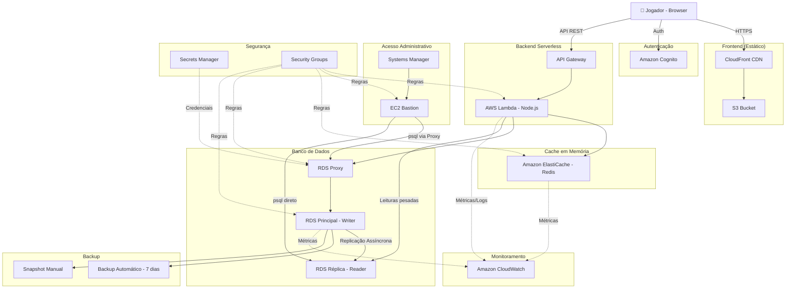
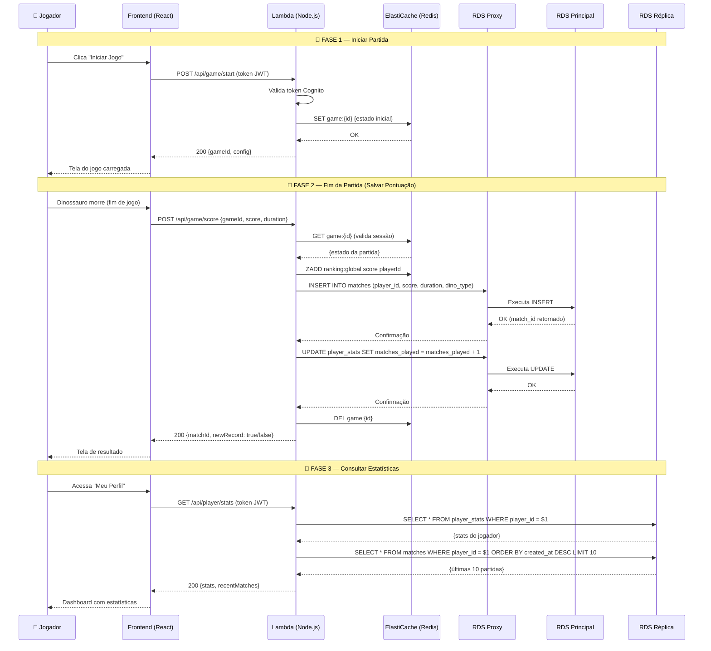
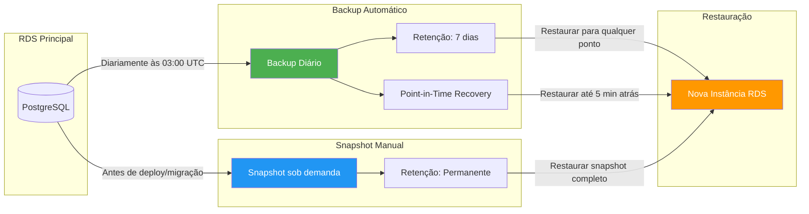
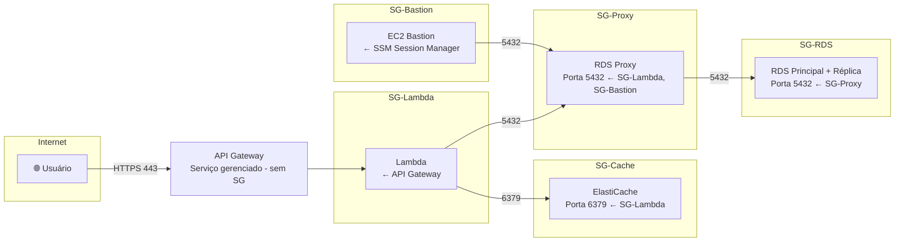

# 🏗️ Arquitetura do Projeto 3 — Amazon RDS, RDS Proxy, Réplica e Backup

## 1. Visão Geral

O **Projeto 3** adiciona a camada de **persistência de dados** ao jogo web de dinossauros na AWS. Enquanto os projetos anteriores tratavam do frontend estático (S3 + CloudFront), autenticação (Cognito) e cache em tempo real (ElastiCache), este projeto introduz:

- **Amazon RDS (PostgreSQL)** como banco de dados relacional principal
- **RDS Read Replica** para distribuir leituras pesadas (ranking, histórico, estatísticas)
- **RDS Proxy** para gerenciamento eficiente de conexões e failover transparente
- **Backups automatizados e snapshots manuais** para recuperação de desastres
- **AWS Secrets Manager** para rotação segura de credenciais

A arquitetura garante que os dados do jogo (partidas, recordes, perfis) sejam armazenados de forma durável, segura e escalável, complementando o cache volátil do ElastiCache.

---

## 2. Diagrama Completo

---

## 3. Responsabilidade de Cada Serviço

### 🟢 ElastiCache (Redis) — Dados Temporários

| Dado | Tipo | TTL | Motivo |
|------|------|-----|--------|
| Sessões de jogo ativas | Hash | 30 min | Estado volátil da partida em andamento |
| Jogadores online | Set | 5 min | Lista em tempo real, muda constantemente |
| Ranking em tempo real | Sorted Set | 60 seg | Atualização frequente durante partidas |
| Salas abertas | Hash | 15 min | Temporário até a partida iniciar |
| Cache de consultas | String | 30 seg | Evitar queries repetidas ao banco |

### 🔵 RDS Principal (Writer) — Escritas Persistentes

| Operação | Tipo SQL | Exemplo |
|----------|----------|---------|
| Registrar partida | INSERT | `INSERT INTO matches (player_id, score, duration, dino_type)` |
| Atualizar recorde | UPDATE | `UPDATE player_stats SET best_score = $1 WHERE player_id = $2` |
| Salvar perfil | INSERT/UPDATE | `INSERT INTO players (cognito_id, nickname) ON CONFLICT UPDATE` |
| Registrar conquista | INSERT | `INSERT INTO achievements (player_id, achievement_type)` |

### 🟣 RDS Réplica (Reader) — Leituras Pesadas

| Consulta | Tipo | Frequência |
|----------|------|------------|
| Ranking global (top 100) | SELECT + ORDER BY | Alta — página de ranking |
| Histórico de partidas | SELECT + JOIN | Média — perfil do jogador |
| Estatísticas do jogador | SELECT + Agregações | Média — dashboard pessoal |
| Relatórios gerais | SELECT + GROUP BY | Baixa — painéis administrativos |

### 🟠 RDS Proxy — Gerenciamento de Conexões

| Função | Descrição |
|--------|-----------|
| Connection Pooling | Mantém pool de conexões reutilizáveis com o banco |
| Reutilização de conexões | Multiplica conexões entre múltiplas instâncias do backend |
| Failover transparente | Redireciona automaticamente para nova instância em caso de falha |
| Integração com Secrets Manager | Obtém e rotaciona credenciais sem alterar código da aplicação |
| Redução de overhead | Evita custo de abrir/fechar conexões TCP+SSL a cada request |

---

## 4. Fluxo de uma Partida

---

## 5. Fluxo de Backup e Restauração

### Configuração de Backup

| Parâmetro | Valor | Descrição |
|-----------|-------|-----------|
| Backup automático | Habilitado | Ativado por padrão |
| Janela de backup | 03:00–04:00 UTC | Horário de menor tráfego |
| Retenção automática | 7 dias | Últimos 7 backups disponíveis |
| Point-in-Time Recovery | Habilitado | Restaurar para qualquer segundo nos últimos 7 dias |
| Snapshots manuais | Antes de deploys | Retenção permanente até exclusão manual |
| Criptografia | AES-256 (KMS) | Backups criptografados em repouso |

---

## 6. Segurança

### Princípios de Segurança Aplicados

1. **Princípio do menor privilégio** — Cada Security Group permite apenas o tráfego estritamente necessário
2. **Defesa em profundidade** — Múltiplas camadas de segurança (SG → Subnets privadas → Criptografia)
3. **Sem acesso público ao banco** — RDS e ElastiCache em subnets privadas, sem IP público
4. **Criptografia em trânsito** — TLS/SSL em todas as conexões (API Gateway→Lambda, Lambda→Cache, Proxy→RDS)
5. **Criptografia em repouso** — AES-256 via AWS KMS para dados no RDS e backups
6. **Rotação de credenciais** — Secrets Manager rotaciona senhas do banco automaticamente
7. **Autenticação IAM** — RDS Proxy usa IAM Authentication, eliminando senhas hardcoded
8. **Isolamento de rede** — VPC com subnets privadas (Lambda, Cache, DB) e acesso administrativo via SSM
9. **Logs de auditoria** — CloudTrail registra todas as chamadas de API aos recursos

---

## 7. Recursos AWS Utilizados

| Serviço AWS | Função no Projeto |
|-------------|-------------------|
| Amazon S3 | Hospedagem dos arquivos estáticos do frontend (HTML, CSS, JS, assets) |
| Amazon CloudFront | CDN para distribuição global com baixa latência e cache de borda |
| Amazon Cognito | Autenticação e gerenciamento de usuários (sign-up, login, JWT) |
| Amazon API Gateway | Expõe a API REST para o frontend |
| AWS Lambda | Executa o backend Node.js (serverless) |
| Amazon EC2 (Bastion) | Acesso administrativo ao RDS via Systems Manager Session Manager |
| Amazon ElastiCache (Redis) | Cache em memória para dados temporários e real-time |
| Amazon RDS (PostgreSQL) | Banco de dados relacional principal para persistência |
| RDS Read Replica | Réplica de leitura para consultas pesadas (ranking, histórico) |
| Amazon RDS Proxy | Pool de conexões, failover transparente e integração com Secrets Manager |
| AWS Secrets Manager | Armazenamento e rotação automática de credenciais do banco |
| AWS KMS | Gerenciamento de chaves para criptografia de dados em repouso |
| Amazon CloudWatch | Monitoramento de métricas, logs e alarmes de todos os serviços |
| AWS CloudTrail | Auditoria de chamadas de API e ações em recursos AWS |
| Amazon VPC | Isolamento de rede com subnets públicas e privadas |
| Security Groups | Firewall virtual com regras de entrada/saída por serviço |

---

## 8. Benefícios da Arquitetura

1. **Alta disponibilidade** — RDS Multi-AZ com failover automático via RDS Proxy garante continuidade mesmo com falha de uma zona de disponibilidade

2. **Performance otimizada** — Separação de leituras (Réplica) e escritas (Principal) evita contenção e melhora tempo de resposta

3. **Escalabilidade horizontal** — Possibilidade de adicionar mais réplicas de leitura conforme o número de jogadores cresce

4. **Eficiência de conexões** — RDS Proxy reutiliza conexões, suportando milhares de requisições simultâneas sem esgotar o limite do banco

5. **Recuperação de desastres** — Backups automáticos diários + Point-in-Time Recovery permitem restaurar dados de qualquer momento nos últimos 7 dias

6. **Segurança em camadas** — Security Groups encadeados + subnets privadas + criptografia + rotação de credenciais formam defesa em profundidade

7. **Custo otimizado** — ElastiCache absorve consultas frequentes, reduzindo carga (e custo) no RDS; réplica de leitura é mais barata que escalar o principal

8. **Operação simplificada** — Secrets Manager rotaciona credenciais automaticamente, backups são automáticos, e CloudWatch alerta sobre anomalias antes que se tornem incidentes
